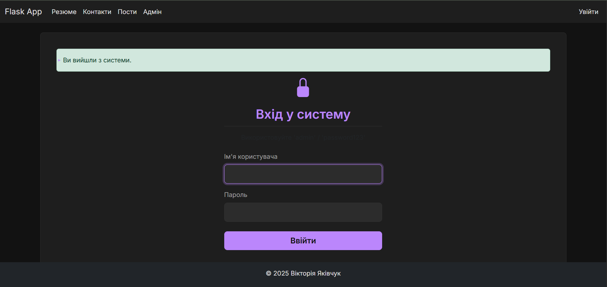
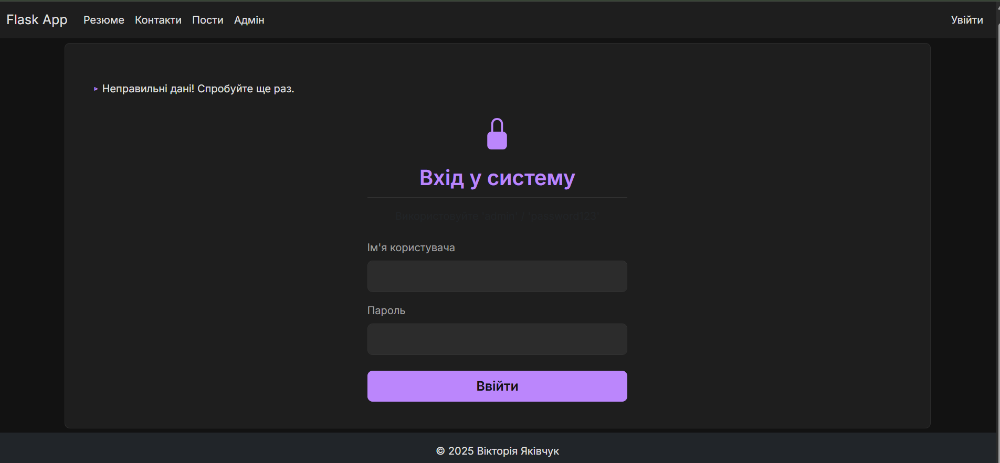
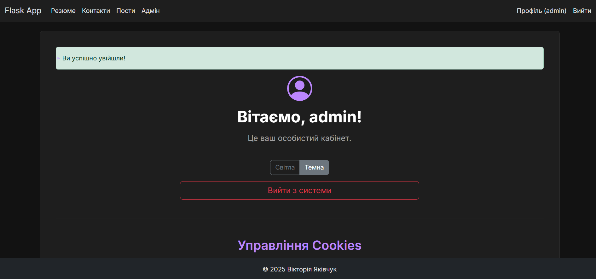
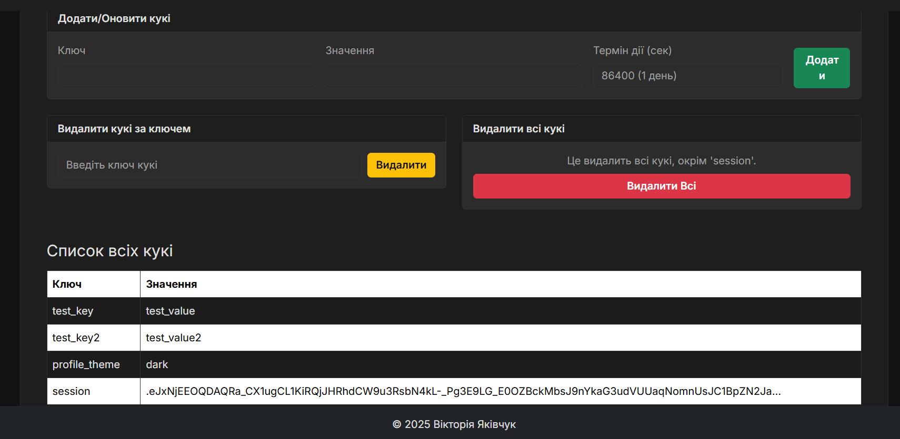
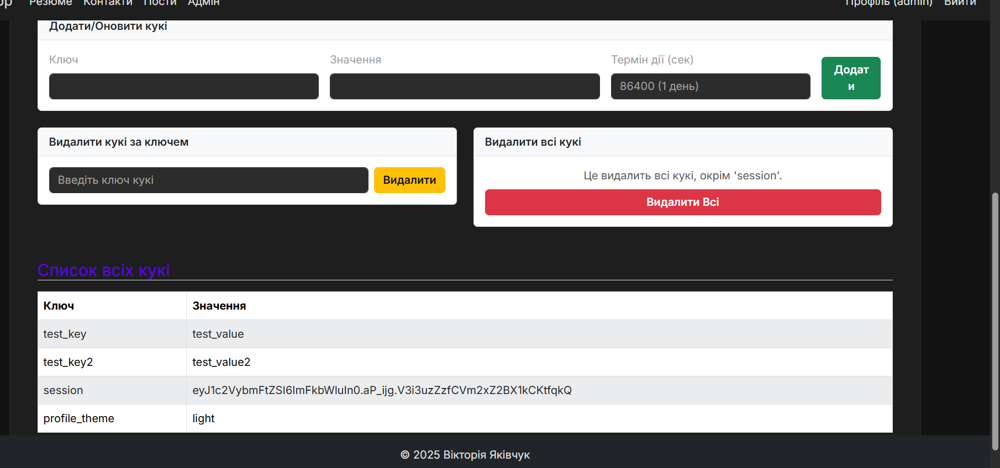

# Лабораторна робота №4

Виконано завдання з реалізації сесій, управління cookies та перемикача тем.

### Завдання 1: Сесії та Flash-повідомлення
Реалізовано стилізовану сторінку входу та профіль.





---

### Завдання 2: Управління Cookies
Додано форми та таблицю для управління cookies на сторінці профілю.



---

### Завдання 3: Перемикач теми
Реалізовано перемикач (Світла/Темна) для сторінки профілю, вибір зберігається в кукі.


```eof