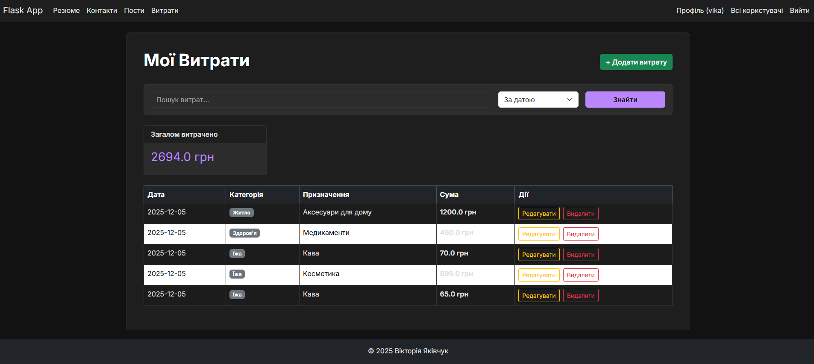
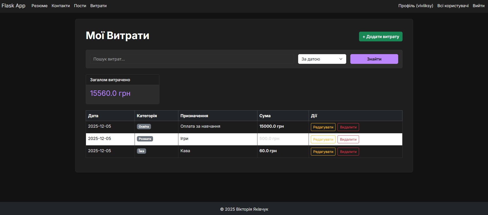
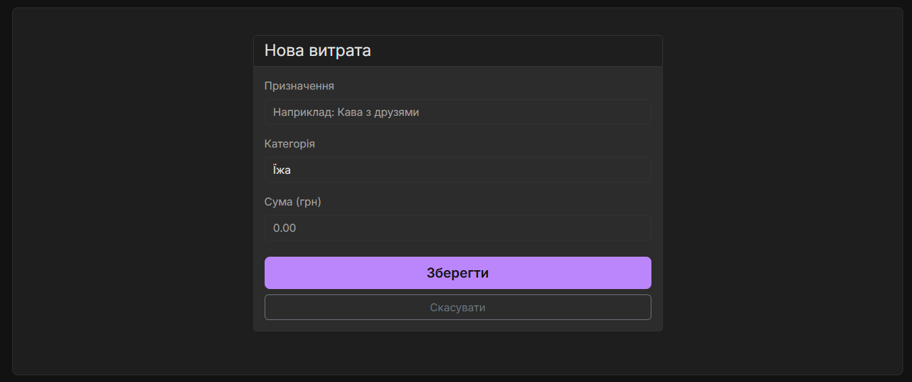
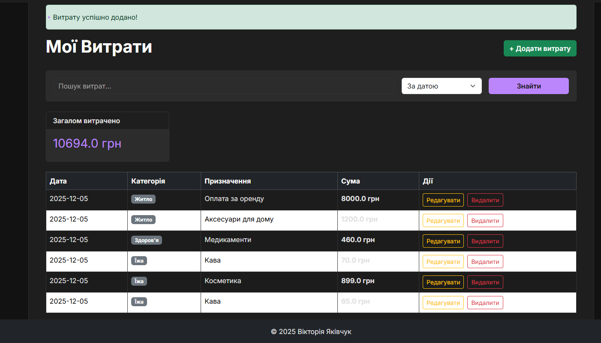
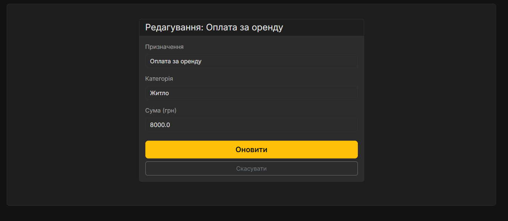
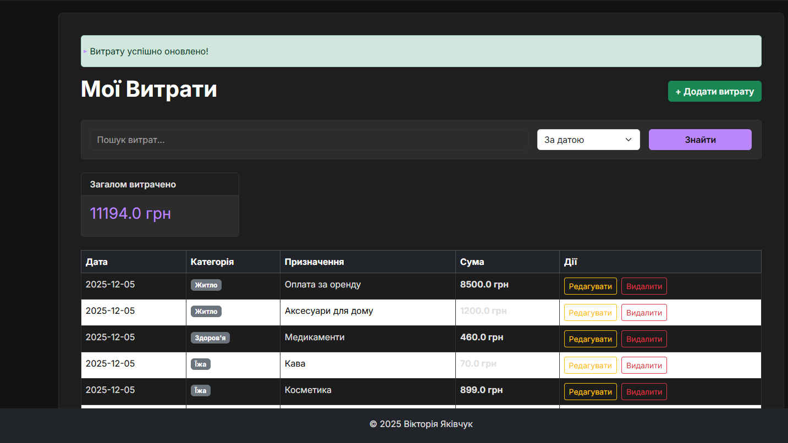
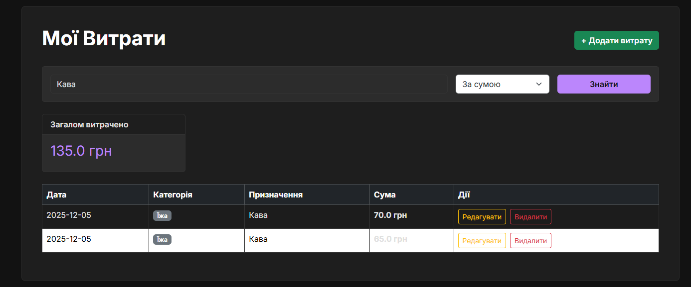
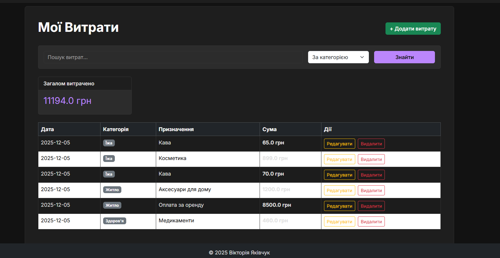
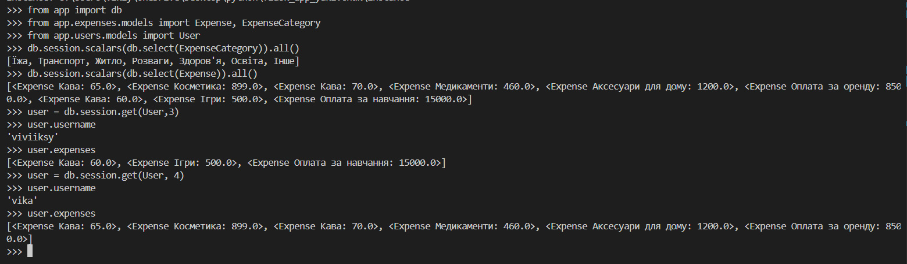

# Самостійна робота: Модуль "Облік Витрат" (CRUD) 

Реалізовано модуль для ведення обліку особистих фінансів (Варіант 28). Проект виконано у вигляді окремого Blueprint `expenses`.

### Функціонал
1.  **Моделі даних:**
    * `ExpenseCategory` (Довідник категорій: Їжа, Транспорт тощо).
    * `Expense` (Витрата: сума, опис, дата).
    * Реалізовано зв'язок з користувачем (`User`), щоб кожен бачив лише власні витрати.
2.  **CRUD операції:**
    * **C**reate: Додавання витрати з вибором категорії.
    * **R**ead: Перегляд списку витрат з підрахунком загальної суми.
    * **U**pdate: Редагування існуючих записів.
    * **D**elete: Видалення записів.
3.  **Пошук та Сортування:**
    * Фільтрація витрат за назвою.
    * Сортування за датою, сумою або категорією.
4.  **Безпека:**
    * Редагування та видалення доступне лише власнику запису (перевірка `user_id`).

### Скріншоти

### Тестування ORM (Flask Shell)
Перевірка роботи моделей та зв'язків через консоль:
1.  Перевірка наявності категорій витрат.
2.  Перевірка записів витрат та їх зв'язку з користувачем (`user.expenses`).
    