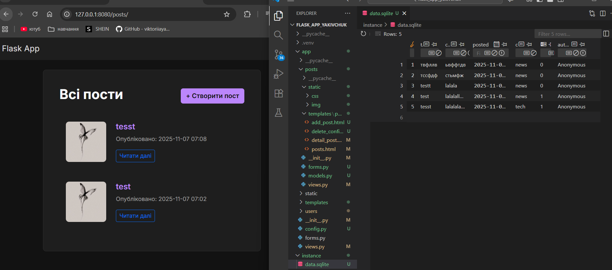
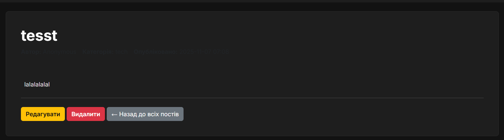
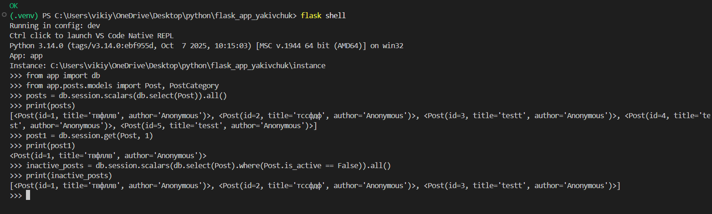

# Лабораторна робота №6
### 1. 

## Частина 6: Ручне тестування (CRUD)

### 1. Список всіх постів
Сторінка `/posts` відображає всі активні пости. Використовується кастомний CSS (`posts.css`) та зображення-заглушка (`default.jpg`) з `static` папки блюпринта.

### 2. Створення/редагування
Форма `PostForm` (на сторінках `/posts/create` та `/posts/<id>/update`) тепер включає всі поля з нової моделі, такі як `SelectField` для `Enum`-категорії та `DateTimeLocalField` для дати.

### 3. Детальна сторінка поста
Сторінка `/posts/<id>` відображає повну інформацію про пост, включаючи нові поля "Автор" та "Категорія" з моделі.

### 4. Підтвердження/успішне видалення поста

### 4. Перевірка даних у `flask shell`
За допомогою `flask shell` можна робити прямі запити до бази даних (наприклад, `db.session.scalars(db.select(Post)).all()`), щоб переконатися, що дані були коректно збережені.

---

##  Модульні тести

### 1. Запуск `unittest`
Команда `python -m unittest discover tests` автоматично знаходить і запускає всі тести в папці `tests/`. Результат `OK` підтверджує, що логіка моделі `Post` (включно зі створенням, `__repr__` та `default` значеннями) працює коректно.

