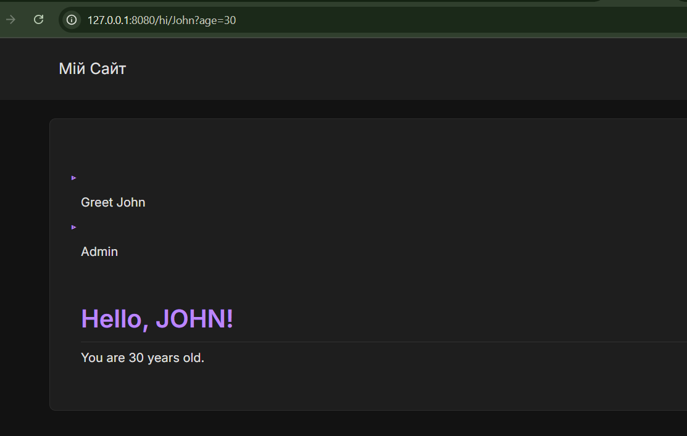
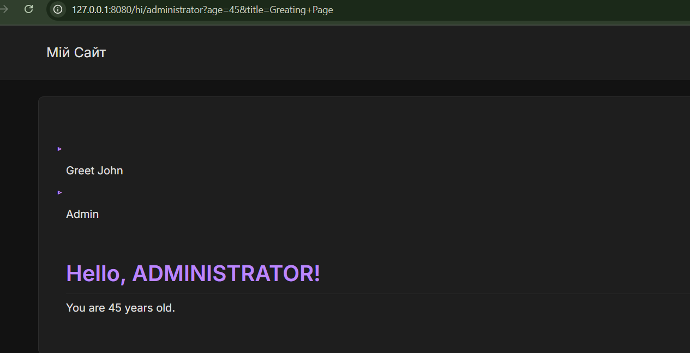
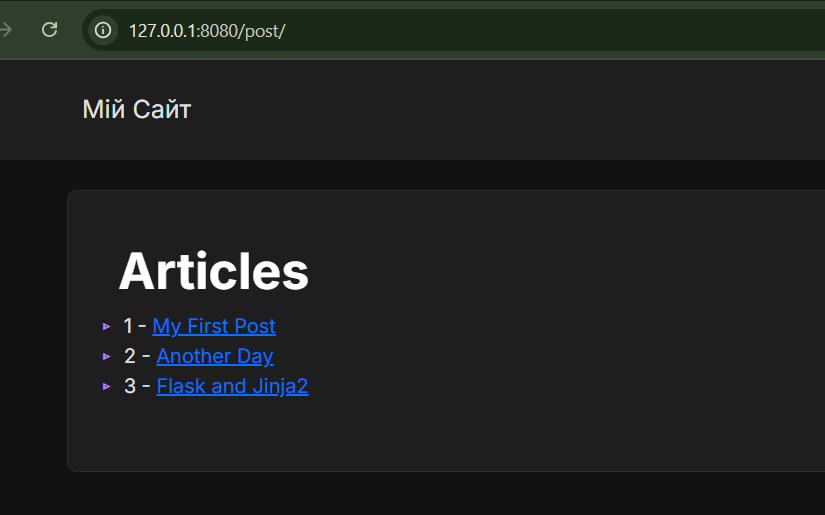
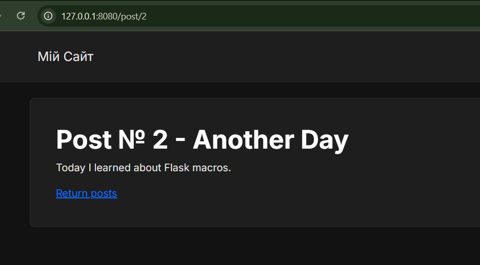
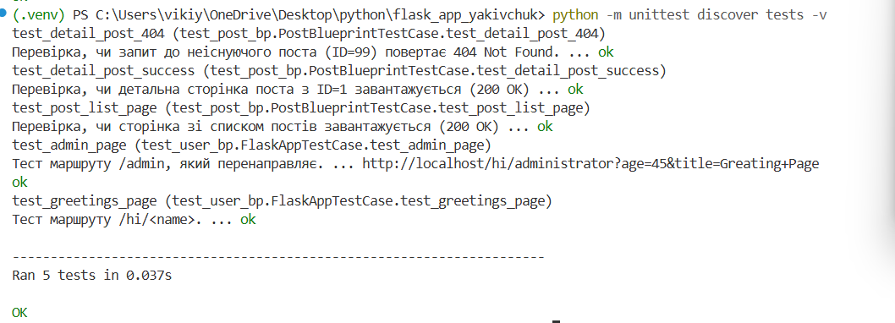

---

## Лабораторна робота №3: Структура та Скріншоти

### Скріншоти Роботи Додатку

Нижче наведено скріншоти роботи реалізованих блюпринтів.

**Модуль `users`**
* Сторінка привітання (`/users/hi/john`):
    
* Сторінка адміністратора (`/users/admin`):
    

**Модуль `products` (або `posts`)**
* Сторінка з постами/товарами:
    
    

### Результати Тестування
Успішне проходження модульних тестів:
