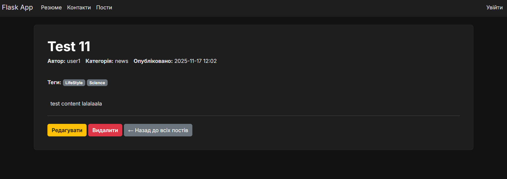

# Лабораторна робота №8

У цій лабораторній роботі ми реалізували зв'язки ORM (One-to-Many та Many-to-Many)

### Пункт 7: Виведення постів для користувачів

Перевірка зв'язку "один-до-багатьох" у `flask shell`.

### Пункт 8: Форма з вибором автора

Оновлена форма створення/редагування поста з `SelectField` для вибору автора.
(Тут буде ваш скріншот сторінки `/posts/create` зі списком авторів)

### Пункт 10: Робота з тегами (Many-to-Many)

Перевірка зв'язку "багато-до-багатьох" у `flask shell` (додавання тегів до постів та їх виведення).
(Тут буде ваш скріншот виводу `p1.tags` та `tag_tech.posts`)

### Пункт 11: Форма з вибором тегів

Оновлена форма створення/редагування поста з `SelectMultipleField` для вибору тегів.

### Пункт 12: Відображення тегів на сторінці
Фінальний вигляд сторінки деталей поста, де відображаються обрані теги.
