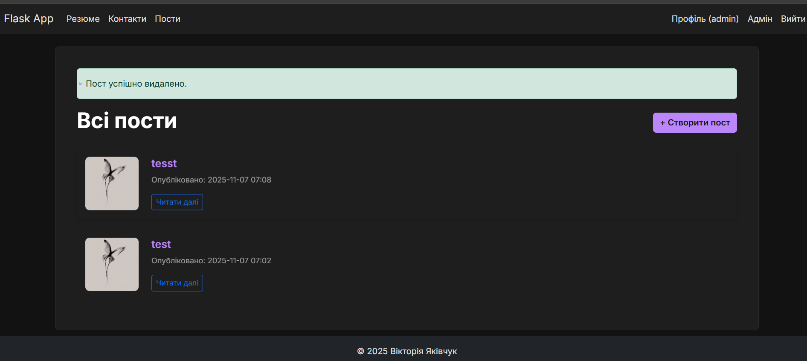

# Лабораторна робота №9: Побудова системи реєстрації та входу

У цій лабораторній роботі було реалізовано повноцінну систему автентифікації користувачів з використанням `Flask-Login`, безпечне зберігання паролів через `Flask-Bcrypt` та захист маршрутів.

### Перевірка хешування паролів

Перевірка роботи `Bcrypt` у `flask shell`. Показано генерацію хешу та перевірку правильності пароля.

### Реєстрація користувачів

#### Форма реєстрації з валідацією
Демонстрація роботи валідаторів (перевірка унікальності email/username, співпадіння паролів).

#### Успішна реєстрація
Повідомлення про успішне створення акаунту та перенаправлення на сторінку входу.

### Вхід та Профіль користувача

Реалізовано вхід у систему за допомогою email та пароля. Після успішного входу користувач потрапляє на захищену сторінку профілю. Меню навігації змінюється (з'являються пункти "Профіль", "Всі користувачі", "Вийти").

### Список користувачів

Сторінка, доступна лише авторизованим користувачам, яка відображає список всіх зареєстрованих у системі.

### Тестування

Написано та успішно пройдено автоматичні тести (`tests/test_auth.py`) для перевірки реєстрації, входу, виходу та доступності сторінок.
